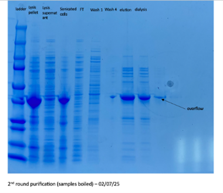
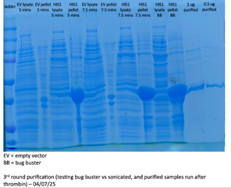
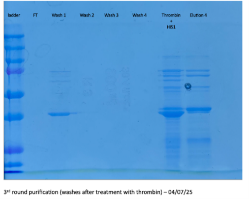

# Lab notebooks

**Pre-lab Research**

* Research into HIS1 (4-hydroxyphenylpyruvate dioxygenase (HPPD) inhibitor sensitive enzyme)

---

**Week 1 (16/06-22/06)**  
* Preliminary Research into HIS1 (4-hydroxyphenylpyruvate dioxygenase (HPPD) inhibitor sensitive enzyme)  
* Worked on understanding the mechanism of the enzyme  
* Analysed the structure  
* Started modelling and docking PP on HIS1  

---

**Week 2 (23/06-29/06)**  
* Supervisor meeting  
* Acquired HIS1 and empty vector (EV) constructs  
* Expressed the HIS1 and EV constructs  

---

**Week 3 (30/06-06/07)**  
* first round of purification  
  * Elution did not show an absorbance peak  
* More expression of HIS1 and EV constructs and stored cell pellets at -20ᵒC for future use.  
* Purified the constructs and ran an SDS gel to confirm expression of HIS1

* Ran gels for analysis of lysis strategies

   

•	04/07 – degradation mixtures set up with HIS1 lysate, Empty Vector lysate, and Purified HIS1 with polypropylene film and fibres.

---

**Week 4 (07/07-11/07)**
* Reaction mixtures were exchanged every day in preparation for GC-MS
* Surface Contact Angle (SCA) was optimised with the camera and the light source
  * Analysis was done with ImageJ DropShape Plugin 
  * 07/07-10/07 – reaction mixtures exchanged and measurements taken every 24 hours
* AFM 
  * 10/07 - Reaction mixtures set up on 5mg red PP
  * 11/07 – Reaction mixtures exchanged and left over the weekend
* Activity of HIS1 using mass spec was explored, targeting reported substrates like HPP
* Preliminary testing of Ni-PV assay
 * PP fibres were treated with HIS1 lysate and EV lysate
 * No result as an incorrect blank was used and the spec was unknown as a calibration curve was not done prior.  

---

**Week 5 (14/07-18/07)**
* 14/07 – EV lysate and pure HIS1 treated red PP sent for AFM analysis
* Tested lysis methods (sonication and BugBuster) for precipitation of HIS1
   * Quantification on SDS gels confirms no precipitation
* SCA optimisation with camera and light source was continued
  * At the end of the week, we decided to discontinue this method.
  * Tensiometer was sourced and read for SCA analysis in the coming week 
* Ni-PV assay
  * A calibration curve was made to decipher the appropriate concentration of Ni2+ to use
  * Deciphered the appropriate volume of reaction mix (with PP fibre) that should be used for the assay.
  * Another round of testing showed that lysate and FeSO4 were interfering with the assay. So plastics need to be cleaned before testing.
  * PV dye is light sensitive, so a change in absorbance was measured over 8 minutes. There was no significant change in absorbance.
* 25/07 – set up reaction mixtures on clear film

---

---
  
