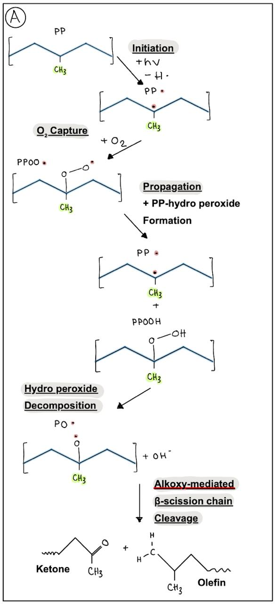
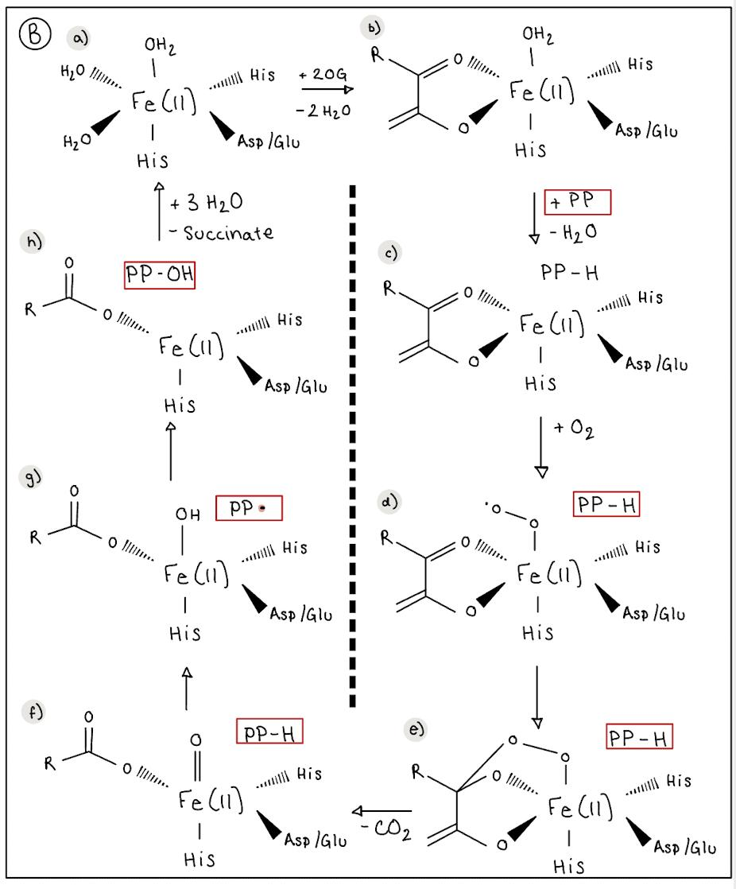

# Background

---

### Polypropylene and its challenges
Polypropylene (PP) accounts for 14% of global polymer production, yet its recycling rate remains below 1% [^1]. Approximately 60% of manufactured plastics are ultimately discarded, contributing to landfill accumulation and environmental pollution [^2]. While most research on plastic biodegradation has targeted hydrolysable polymers like PET, PP remains resistant due to its non-hydrolysable backbone and high crystallinity [^3]. The chemical structure of PP, consisting of strong covalent bonds [CH3CH6]n, makes it highly resistant to enzymatic attack. 

Degradation of PP typically occurs through abiotic pathways, primarily initiated by UV-induced cleavage of C-H bonds. This photochemical process generates hydroperoxides and triggers radical chain reactions, leading to β-scission and the formation of oxygenated fragments like ketones, aldehydes, and olefins. This process can be seen in the figure below.

  

### The discovery of HIS1

A recent breakthrough identified an enzyme capable of notable PP degradation through hydroxylation. Tan et al. performed a metagenomic screen for bioremediation-related enzyme sequences, leading to the discovery of HIS1, an Fe(II)/2-oxoglutarate-dependent oxygenase originally found in *Oryza sativa japonica*. 
This enzyme family employs a conserved 2-His-1-carboxylate facial triad to activate O₂, generating a high-valent Fe(IV)=O intermediate, and abstract hydrogen atoms from otherwise inert C–H bonds before hydroxylation [^4]. 

  

HIS1 is known to confer resistance to multiple β-triketone herbicides (bTHs), such as benzobicylon (BBC), by catalysing their hydroxylation, which neutralises their HPPD-targeting activity [^5]. Its demonstrated ability to detoxify a wide range of structurally related substrates highlights its promiscuity and suggests a potential function as a polypropylene oxygenase (PPase) capable of polymer hydroxylation.

### Directed Evolution Approaches for PP degradation

Directed evolution (DE) is a powerful strategy for improving biomolecule function. It mimics natural evolution by generating genetic diversity through mutagenesis, followed by screening for desired traits. In this project, we applied a combination of site-directed and combinatorial mutagenesis to target surface-exposed residues of HIS1. The hypothesis was that increasing hydrophobicity at these residues would enhance binding to PP surfaces through stronger hydrophobic interactions.

### High-Throughput Screening Assay Development

A major challenge in applying DE to PP degradation is the lack of high-throughput assays capable of detecting subtle enzymatic activity on polymers. To address this, an important goal of this project was to develop a novel screening method that detects functional groups produced by polymer oxidation. This approach would enable the efficient evaluation of the mutant library and provide a valuable tool for other DE projects targeting polymers similar to PP.

[^1]: NORDAHL, S. L., BARAL, N. R., HELMS, B. A. & SCOWN, C. D. 2023. Complementary roles for mechanical and solvent- based recycling in low- carbon, circular polypropylene. Proceedings of the National Academy of Sciences of the United States of America, 120, 8. DOI: 10.1073/pnas.2306902120
[^2]: GEYER, R., JAMBECK, J. R. & LAW, K. L. 2017. Production, use, and fate of all plastics ever made. Science Advances, 3, 5. DOI: 10.1126/sciadv.1700782
[^3]: WANG, N., HE, S. B., YANG, B. B., ZHANG, H., LIU, D. D., SONG, P. F., CHEN, T. T., WANG, W. Q., GE, H. H. & MA, J. M. 2024. Crystal structure of HPPD inhibitor sensitive protein from Oryza sativa. Biochemical and Biophysical Research Communications, 704, 5.  DOI: 10.1016/j.bbrc.2024.149672
[^4]: MARTINEZ, S. & HAUSINGER, R. P. 2015. Catalytic Mechanisms of Fe(II)-and 2-Oxoglutarate-dependent Oxygenases. Journal of Biological Chemistry, 290, 20702-20711.  DOI: 10.1074/jbc.R115.648691
[^5]: Maeda, H., Murata, K., Sakuma, N., Takei, S., Yamazaki, A., Karim, M. R., Kawata, M., Hirose, S., Kawagishi-Kobayashi, M., Taniguchi, Y., Suzuki, S., Sekino, K., Ohshima, M., Kato, H., Yoshida, H., & Tozawa, Y. (2019). A rice gene that confers broad-spectrum resistance to β-triketone herbicides. Science. https://doi.org/aax0379

