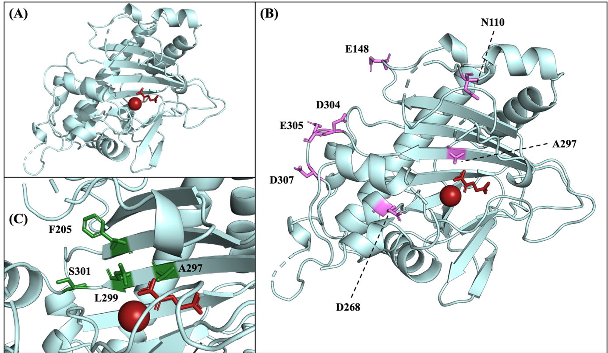
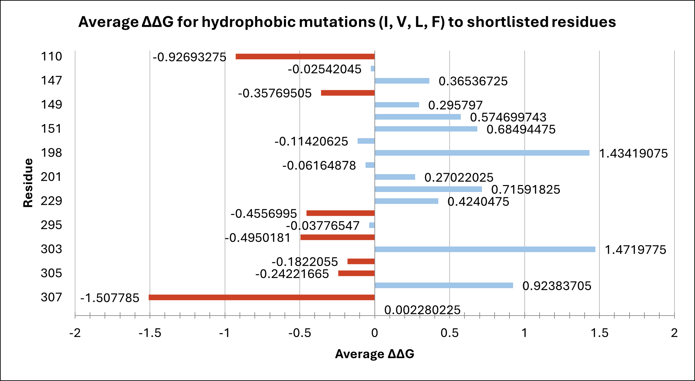
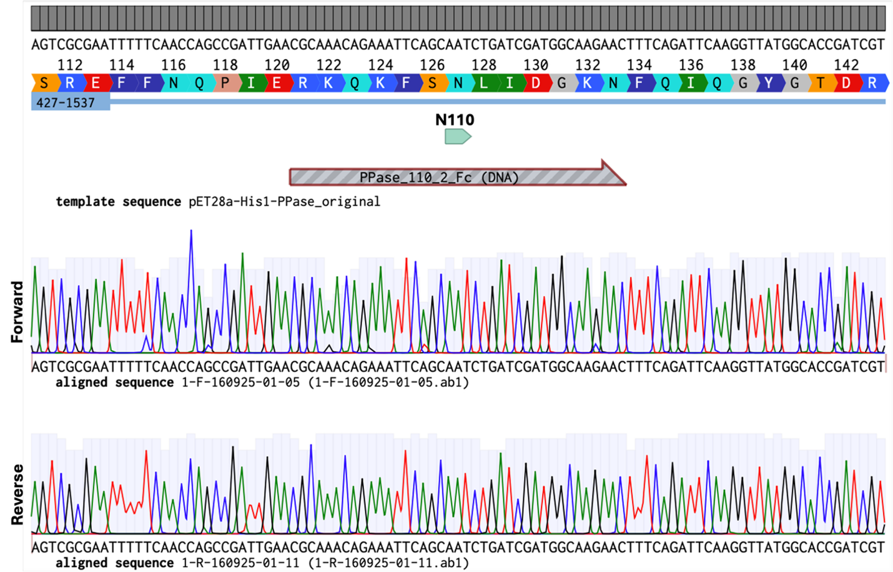
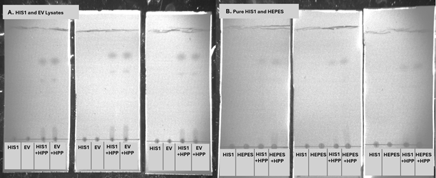
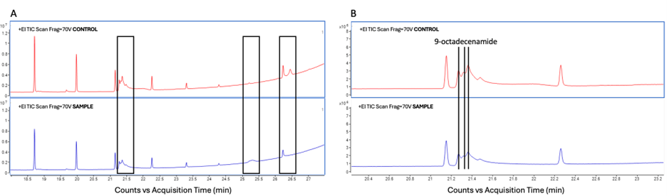
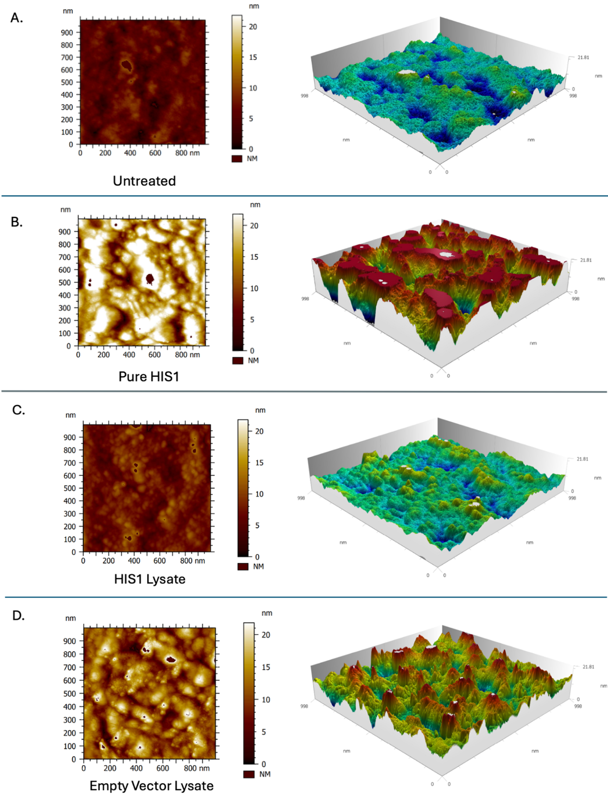
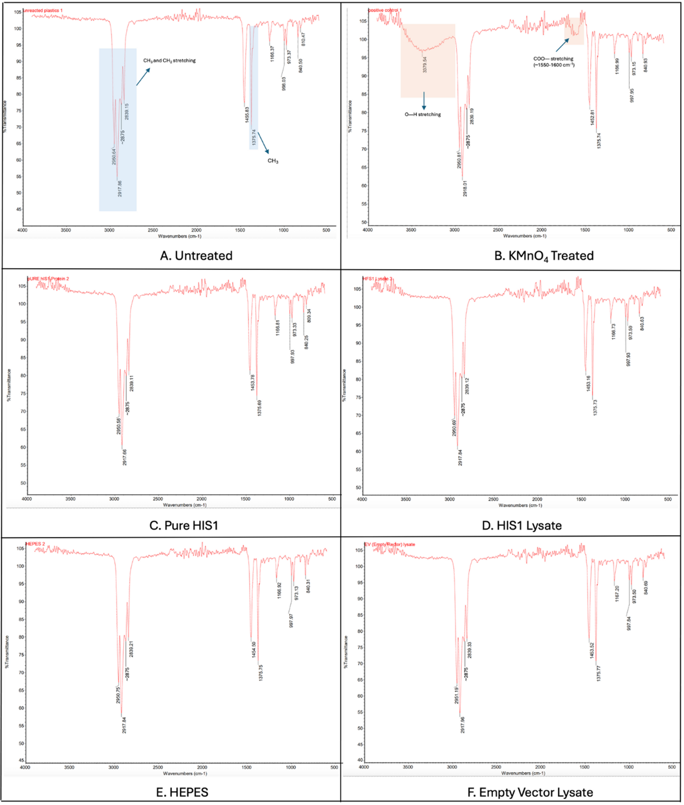

# Results

### Directed Evolution and Computational Analysis

Molecular dynamics and docking simulations of the enzyme HIS1 with PP identified several surface-exposed residues as potential mutation targets to enhance substrate binding. FoldX-based mutational stability screening suggested seven key sites (N110, E148, A297, D304, E305, D307) (Fig. 1) with favourable ΔΔG values below -0.15, indicating potential structural stability upon substitution with hydrophobic residues. Due to screening capacities and time restraints, we identified the degenerate codon DTN to be optimal for our experiments, as it yields an array of four hydrophobic residues (I, V, L, and F) and a stop codon (Fig. 2).

 
***Figure 1. HIS1 structure with co-factors Fe2+ and 2-OG highlighted in red.*** *(A) Structure of HIS1 adapted from PDB: 8y4u. Positioning of 2-OG was derived from alignment with PDB: 8s7b. (B) Target residues were identified through computational analyses and are highlighted in pink. The degenerate codon DTN was used to substitute these residues with more hydrophobic (I, V, L, or F) residues. (C) The proposed active site of HIS1[^1]. The 4 residues highlighted in green are proposed to interact with the substrate.*

 
***Figure 2. Average ΔΔG of shortlisted residues.*** *ΔΔG was calculated for all four hydrophobic residues encoded by the degenerate codon DTN before an average value was calculated. Targets selected for mutation are highlighted in red. Selection was conducted using a threshold value of -0.15.  ΔΔG is the measure of the change in protein folding free energy, where ΔΔG = ΔGMutant – ΔGWT; a positive value means the mutation could destabilise the protein, whereas a negative value means the mutation could stabilise the structure[^2][^3]*

### Library Generation

To efficiently minimize library size, a dual-screen approach was adapted. Single-site mutants were intended for initial screening, followed by combinatorial mutagenesis of beneficial variants. To generate site-directed mutations, we adapted a protocol for combinatorial library generation to create single-site mutants [^4]. This strategy was chosen as it would facilitate both single-site and combinatorial mutagenesis. However, sequencing of transformed colonies confirmed the presence of the gene but not the intended N110 mutation, halting further library construction.

 

***Figure 3. Representative alignment of sequenced colony against the unmutated pET28a-His1 plasmid.*** *The top-aligned sequence is the forward sequencing data, and the bottom-aligned sequence is the reverse sequencing data. Residue N110 is highlighted above in green. No bases in the aligned sequences have been highlighted in red, indicating that the mutation has not been incorporated. All 6 colonies sent for sequencing showed similar results.* 

---

### Evaluation of Enzymatic Activity

#### Thin-Layer Chromatography (TLC)
TLC analysis of HIS1 (in lysate and purified form) incubated with HPP showed no detectable enzymatic activity (Fig. 4). HPP spots remained unchanged compared to the controls, indicating no substrate conversion.

***Figure 4. TLC analysis of HPP breakdown with HIS1 lysate (A) and purified HIS1 (B).*** *(A) Reaction mixtures contained HIS1 lysate, empty vector (Li et al.) lysate, HIS1 + HPP, or EV + HPP. For each condition, samples were spotted in triplicate across (n=3). HPP consistently migrated as two species, with Rf values of 0.72/0.54 labelled (Plate 1), 0.76/0.62 (Plate 2), and 0.77/0.61 (Plate 3). No differences were observed between HIS1 and EV samples, indicating undetectable HIS1 activity under these conditions. (B) Reaction mixtures contained Pure HIS1, HEPES, Pure HIS1 + HPP, or HEPES + HPP. The same method as (A) was used, giving Rf values of 0.72 (Plate 1), 0.70 (Plate 2), and 0.68 (Plate 3). No differences were observed between Pure HIS1 and HEPES samples.*  

#### Gas Chromatography-Mass Spectrometry (GC-MS)

Comparison of untreated and HIS1-treated PP samples showed similar chromatographic profiles (Fig. 5). No expected oxidation products, including: 2-Pentene, Undecane, Dodecane, 3-Methyl-5-propylnonane, 2,6,10-Trimethyltridecane, and 2,6,10,14-Tetramethylpentadecane [^5] were seen in the sample. The main detected compound, 9-octadecenamide, appeared in both samples, suggesting it is not a product of enzymatic breakdown but a contaminant or a product of previous treatment during manufacturing. The method was limited by the potential loss of polar oxidation products during extraction and their possible retention on the polymer surface.

***Figure 5. GC-MS total ion chromatograms (TIC) for Pure HIS1-Treated and Untreated Polypropylene Samples.*** *(A) Overview chromatograms showing major peaks of control (red) and sample (blue). The black boxes denote areas where peaks have appeared, disappeared, or changed in intensity between the sample and control. (B) Detailed view with integrated peak areas for quantitative analysis. 9-octadecenamide was identified as a peak in both the control and sample. GC-MS performed at EdinOmics and figures made by Dr Tessa Moses.*

#### Atomic Force Microscopy (AFM)

AFM imaging revealed increased surface roughness on PP films treated with purified HIS1, while HIS1 lysate and control treatments showed no significant differences. The observed changes may indicate surface interaction or coating by protein, but not necessarily substrate oxidation or degradation.

***Figure 6. 1 μm AFM Scans and 3D topography.*** *Shows picture of the 1 μm scan (left) and their respective modelled topography (right). Pictures of the scans provided by the microscope are compiled and analysed by Dr. Laura Charlton. 3D topography was modelled by Dr. Laura Charlton. (A) ‘Untreated’ is the negative control sample of just the PP film. (B) ‘Pure HIS1’ is the PP film treated with the purified HIS1 enzyme. (C) ‘HIS1 Lysate’ is the PP film treated with the HIS1 lysate. (D) ‘Empty Vector Lysate’ is the PP film treated with the empty vector (Li et al., 2018) lysate.*

#### Fourier Transform Infrared Spectroscopy (FTIR)

FTIR spectra of HIS1-treated samples showed no detectable oxidation peaks compared to oxidised KMnO₄ controls. The characteristic PP bands were unchanged, suggesting minimal to no chemical modification of the surface by HIS1 under the tested conditions.

***Figure 10. Infrared Spectra from FTIR Analysis of PP film surface.*** *FTIR measurements and analysis were done by Cara Kane within Dr. Simone Dimartino’s lab. (A) ‘Untreated’ is the negative control sample of just the PP film. (B) ‘KMnO4-Treated’ is the positive control sample of PP chemically oxidised by KMnO4. (C) ‘Pure HIS1’ is the PP film treated with the purified HIS1 enzyme. (D) ‘HIS1 Lysate’ is the PP film treated with the HIS1 lysate. (E) ‘HEPES’ is the PP film treated in HEPES buffer.  (F) ‘Empty Vector Lysate’ is the PP film treated with the empty vector (Li et al., 2018) lysate. Important peaks are annotated by coloured boxes. Blue indicates peaks characteristic of polypropylene, while orange indicates peaks characteristic of plastic oxidation.*

--- 

### High-Throughput Assay Development

#### Toluidine Blue O (TBO) Assay

A colorimetric assay using Toluidine Blue O successfully distinguished between untreated and chemically oxidised PP microtubes, with approximately a 20-fold higher absorbance in oxidized samples. While effective in microtube format, the assay showed inconsistent results in 96-well plates, likely due to dye degradation, requiring further optimisation for high-throughput use.

#### Nickel-Pyrocetechol Violet (Ni-PV) Assay

A secondary colorimetric assay quantified surface carboxyl groups via Ni²⁺ binding. KMnO₄-treated PP tubes showed reduced absorbance, consistent with surface oxidation, but statistical significance was marginal (p ≈ 0.058 after Welch’s correction). The assay detection limit was estimated at ~0.064 µmol·cm⁻² of carboxyl groups. No measurable oxidation was detected on HIS1-treated samples, suggesting enzyme inactivity or sub-threshold surface modification.

--- 

### Summary

Overall, computational modeling identified seven potential mutation targets for HIS1 aimed at improving PP binding. Experimental mutagenesis efforts partially succeeded in producing single-site mutants, through confirmed substitutions were not achieved. Enzymatic assays and analytical techniques (TLC, GC-MS, AFM, FTIR) showed no definitive evidence of HIS1 activity against polypropylene. Two colorimetric assays for detecting PP surface oxidation were developed and validated for positive controls, but HIS1-treated samples produced no measurable oxidation under current conditions.

 
[^1]: WANG, N., HE, S. B., YANG, B. B., ZHANG, H., LIU, D. D., SONG, P. F., CHEN, T. T., WANG, W. Q., GE, H. H. & MA, J. M. 2024. Crystal structure of HPPD inhibitor-sensitive protein from Oryza sativa. Biochemical and Biophysical Research Communications, 704, 5.  DOI: 10.1016/j.bbrc.2024.149672

[^2]:  YAMAMOTO, K., ASAHARA, H., HARADA, K., ITABASHI, Y., OHKUBO, K. & INOUE, T. 2023. One-step antibacterial modification of polypropylene non-woven fabrics via oxidation using photo-activated chlorine dioxide radicals. Journal of Materials Chemistry B, 11, 5101-5107. doi.org/10.1039/D3TB00586K  

[^3]: BUSS, O., RUDAT, J. & OCHSENREITHER, K. 2018. FoldX as Protein Engineering Tool: Better Than Random-Based Approaches? Computational and Structural Biotechnology Journal, 16, 25-33. Available at: https://doi.org/10.1016/j.csbj.2018.01.002  

[^4]: SADLER, J. C., GREEN, L., SWAINSTON, N., KELL, D. B. & CURRIN, A. 2018. Fast and Flexible Synthesis of Combinatorial Libraries for Directed Evolution. In: SCRUTTON, N. (ed.) Enzymes in Synthetic Biology. San Diego: Elsevier Academic Press Inc. DOI: 10.1016/bs.mie.2018.04.006

[^5]: TAN, Q. L., CHEN, W. T., LIU, H., YAN, W. D., HUANG, X. & LI, Y. 2024. The programmed sequence-based oxygenase screening for polypropylene degradation. Journal of Hazardous Materials, 465, 9. DOI: 10.1016/j.jhazmat.2023.133173

