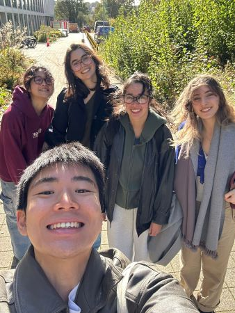
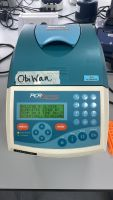
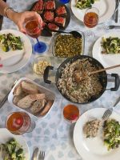

# Our Team

--- 

  
### Livia Del Bo  

**Role:** Team Leader   
**Degree:** BSc Biological Sciences (Biotechnology)  
**Year:** 4th year  
**Favourite iDEC Memory:** Team Potluck.  

---

  

### Cecilia Barcia Pintado  

**Role:** Team Member  
**Degree:** BSc Biological Sciences (Biochemistry)  
**Year:** 4th year  
**Favourite iDEC Memory:** discovering that a syringe can make the purification step a little more bearable.  

---

    
### Kimberly Littler  

**Role:** Team Member  
**Degree:** BSc Biological Sciences (Genetics)  
**Year:** 4th year  
**Favourite iDEC Memory:** The smell of the media kitchen.    

---

  
### Pimvalan Petchmunee  

**Role:** Team Member  
**Degree:** BSc Biological Sciences (Biotechnology)  
**Year:** 4th year  
**Favourite iDEC Memory:** Team Potluck. It was so good it had to be mentioned twice.  

---

    
### Rick Miyamoto  

**Role:** Team Member  
**Degree:** BSc Biological Sciences (Biotechnology)  
**Year:** 4th year  
**Favourite iDEC Memory:** the hours spent with Obi-Wan and Yoda (the PCR machines).   

--- 

### Our Supervisors
Heather Barker, Joanna Sadler, Chris French, and Nadanai Laohakunakorn

---

     

